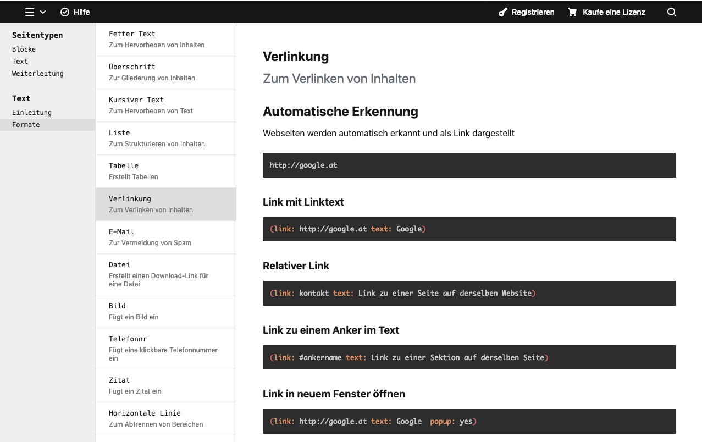

# Kirby 3 Help Section

 

Adds a panel view to display help for users. The help pages are generated by a predefined content folder.



## Commerical usage and support

This plugin is free under the MIT license. If you use it in a commercial project or want to support the development please consider to

- [make a donation](https://www.paypal.me/agenturamteich/2) ☕ or
- [buy a Kirby license using this affiliate link](https://a.paddle.com/v2/click/1129/39016?link=1170) ️️️⭐

## Installation

### Download

Download and copy this repository to `/site/plugins/kirby-helpsection`.

### Git submodule

```
git submodule add https://github.com/amteich/kirby-helpsection.git site/plugins/kirby-helpsection
```

### Composer

```
composer require amteich/kirby-helpsection:@beta
```

## Options

All options require `amteich.helpsection.` as prefix.

**contentfolder**

- default: `helpsection`
- content of this folder is loaded into the help view of the panel

## Setup

Copy the example structure in [examples/content](examples/) to your content folder.

```
content
  helpsection
    doc.txt
    0_contenttypes
      doc.txt
      image.png
    1_text
      doc.txt
```

A template named `doc` comes with the plugin which uses the fields `title`, `excerpt` and `text` to display the pages. The template can also be overwritten in your kirby installation  or you could use your own templates for the documentation pages.

You could also use virtual pages to create pages and subpages. For example this [model](examples/models/textformats.php) generates subpages for a page template `textformats`.

## Disclaimer

This plugin is provided "as is" with no guarantee. Use it at your own risk and always test it yourself before using it in a production environment.

## License

[MIT](LICENSE.md)

## Credits

- [Bastian Allgeier for the kirby reference page](https://github.com/bastianallgeier)
